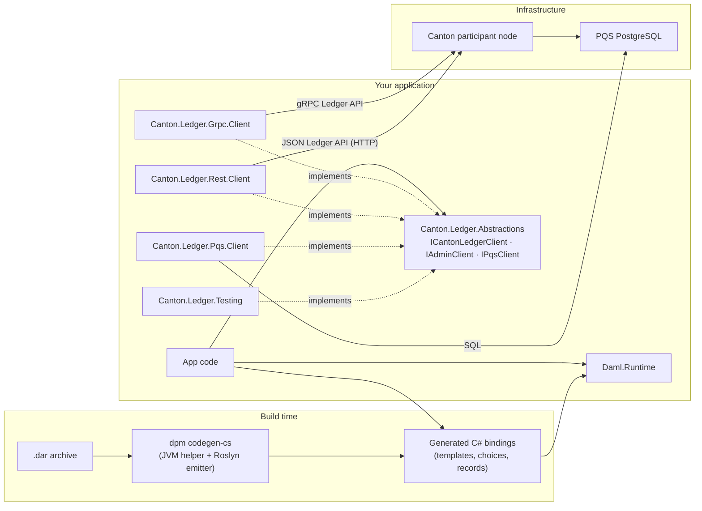
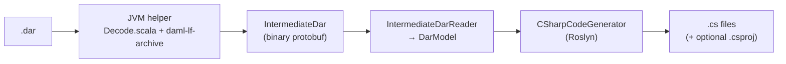
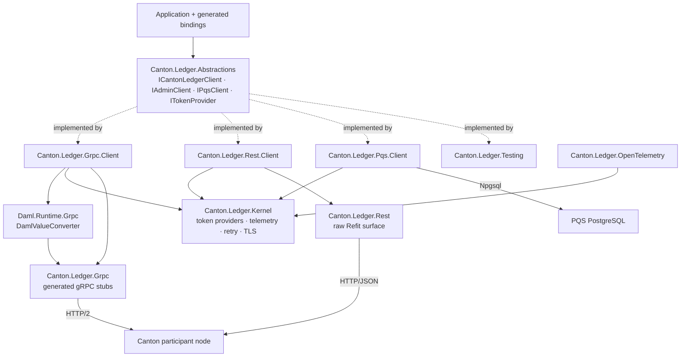
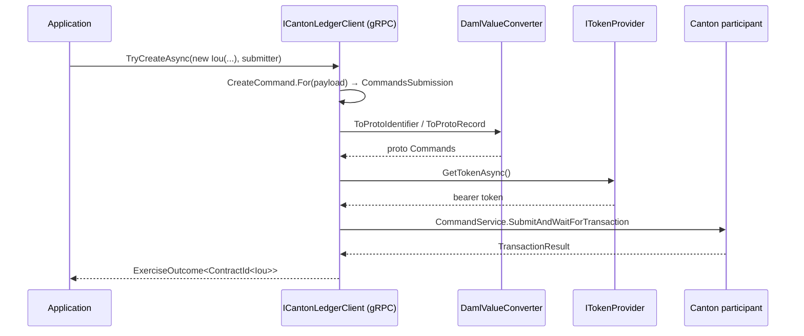

# Architecture Overview

This document describes how the Canton .NET SDK fits together: the code-generation pipeline that turns a Daml archive (`.dar`) into C# bindings, the `Daml.Runtime` library those bindings depend on, and the `Canton.Ledger.*` client packages that talk to a Canton participant node over gRPC or the JSON Ledger API, read contracts from the Participant Query Store (PQS) over PostgreSQL, trace every call with OpenTelemetry, and fake every client surface in tests.

## The big picture

The SDK lives in one repository, `canton-dotnet-sdk`, and every NuGet package in it ships under one version line.

| Area | Packages |
|---|---|
| Codegen | `dpm codegen-cs` (the pipeline, distributed as an OCI bundle), `Daml.Codegen.CSharp` (emitter library), `Daml.Codegen.Intermediate` (the Intermediate DAR model), `Daml.Codegen.Testing.Conformance` (conformance corpus) |
| Runtime | `Daml.Runtime` (value, command and contract vocabulary), `Daml.Ledger.Abstractions` (`ILedgerClient` and its parts), `Daml.Runtime.Grpc` (value bridge to the Ledger API protos) |
| Ledger client | `Canton.Ledger.Abstractions` (neutral contract layer), `Canton.Ledger.Kernel` (authentication, telemetry, retry, TLS), `Canton.Ledger.Grpc` and `Canton.Ledger.Grpc.Client` (gRPC), `Canton.Ledger.Rest` and `Canton.Ledger.Rest.Client` (JSON Ledger API), `Canton.Ledger.Pqs.Client` (PQS) |
| Observability and testing | `Canton.Ledger.OpenTelemetry`, `Canton.Ledger.Testing` (in-memory fakes), `Daml.Ledger.Abstractions.Testing.Conformance` (behavioural test kit for `ILedgerClient` implementations) |



Four layers, four lifecycles:

1. **Codegen** runs at build time (or in CI) and never ships with your application.
2. **`Daml.Runtime`** is the runtime vocabulary shared by generated code and the clients: Daml values, identifiers, command types.
3. **`Canton.Ledger.*`** is the transport layer: gRPC or the JSON Ledger API for command submission, streams and administration, PostgreSQL for PQS queries. Application code depends on the interfaces in `Canton.Ledger.Abstractions` and swaps the implementation behind them.
4. **Observability and testing** are opt-in: `Canton.Ledger.OpenTelemetry` exports the clients' spans, `Canton.Ledger.Testing` replaces a live participant in unit tests.

## The codegen pipeline

Code generation is a two-stage pipeline bridged by a protobuf intermediate format. The split exists because the authoritative Daml-LF decoder (`daml-lf-archive`) is a JVM library, while the emitter targets the .NET ecosystem.



### Stage 1: the JVM helper

A small Scala tool wrapping Digital Asset's `daml-lf-archive` library. It reads the `.dar`, decodes every package and emits a single binary-protobuf `IntermediateDar` message carrying the type surface only: choice and update bodies are erased. By default the helper first runs a static party-expression analysis over each template and choice and records a `Static`/`Dynamic` verdict on its signatories, observers and controllers in the Intermediate DAR. That analysis is sensitive to the Daml-LF patch version. `--schema-only` switches to *schema mode*, which skips the analysis and emits `Dynamic` everywhere, making the output insensitive to Daml-LF patch versions: two DARs differing only by patch version produce byte-identical intermediate output. For a given DAR and tool version, either mode is deterministic.

The intermediate format (`intermediate_dar.proto`) carries the complete type surface: modules, data types (records, variants, enums), templates with their choices, keys, signatories and observers, and interfaces with methods and view types. The JVM helper runs only at codegen time; it is **not** a runtime dependency of generated packages or applications.

### Stage 2: the C# emitter

The .NET side (`Daml.Codegen.CSharp`) parses the `IntermediateDar` protobuf into the in-memory model of the `Daml.Codegen.Intermediate` package, then walks that model with a Roslyn-based generator, emitting:

- **Templates** — sealed records implementing `ITemplate` and `IDamlRecord<TSelf>`, with a static `TemplateId`, typed `ContractId<T>`, and `ToRecord()`/`FromRecord()` serialization.
- **Keyed templates** — additionally implementing `IHasKey<TSelf, TKey>` with a static `KeyDescriptor<TSelf, TKey>` that encodes and decodes the key. A contract read back with its key materializes as `Contract<T, TKey>`.
- **Choices** — nested types on their template (e.g. `Iou.Transfer`) with `ExerciseCommand` builders.
- **Records, variants, enums** — sealed records implementing `IDamlRecord<TSelf>`, variant hierarchies implementing `IDamlVariant`, and C# `enum`s. Only types the DAR actually declares are emitted; placeholder records for unresolved types are not.
- **Interfaces** — types implementing `IDamlInterface`, with `IHasView<TView>` and `IImplements<TInterface>` linking templates to the interfaces they implement. `IHasView<TView>` is a member-less marker; the interface exposes a static `View` witness of type `ViewDescriptor<TInterface, TView>` that a subscription passes to the client.
- Optionally a `.csproj`, so a DAR can be turned directly into a NuGet package.

### Invocation

The pipeline ships as a `dpm` component (an OCI artifact bundling the JVM helper and a self-contained .NET emitter per platform). The emitter needs no host .NET runtime; the JVM helper needs a JDK 17 or newer on `PATH`:

```bash
dpm codegen-cs --dar ./contracts.dar --out ./Generated -n MyCompany.Contracts
```

## The runtime: `Daml.Runtime`

`Daml.Runtime` is a NuGet package published from this repository. It is the shared vocabulary between generated bindings and the ledger clients — the clients reference it as a project dependency and deliberately do not re-implement any of it.

Its main areas:

| Namespace | Provides |
|---|---|
| `Daml.Runtime.Contracts` | `ITemplate`, `IDamlInterface`, `ContractId<T>`, `Contract<T>`, `Contract<T, TKey>`, `ContractKey<TKey>`, `KeyDescriptor<T, TKey>`, `ViewDescriptor<TInterface, TView>`, key/view/implements markers |
| `Daml.Runtime.Data` | The `DamlValue` hierarchy (`DamlInt64`, `DamlNumeric`, `DamlText`, `DamlParty`, `DamlDate`, `DamlTimestamp`, `DamlContractId`, `DamlList`, `DamlOptional`, `DamlTextMap`, `DamlRecord`, `DamlVariant`, …), `Identifier`, and `DamlValueExtensions.FromDamlValue<T>` for unwrapping values to CLR types |
| `Daml.Runtime.Commands` | Transport-agnostic `CreateCommand`, `ExerciseCommand`, `CreateAndExerciseCommand`, `CommandsSubmission`, `SubmitterInfo` |
| `Daml.Runtime.Outcomes` | `ExerciseOutcome<T>` (`One` / `None` / `Many` and the error arms) and `DamlErrorCategory` |
| `Daml.Runtime.Streams` | `ContractStreamEvent<T>` (created, archived, assigned, unassigned, checkpoint) and the ACS snapshot entries |
| `Daml.Runtime.Serialization` | `DamlJsonSerializer` for Ledger API JSON |
| `Daml.Runtime.Stdlib` | Daml standard-library mappings (`Tuple`, `Either`, `Optional<T>`, `Set`, `Map`, `NonEmpty`, …) |

Generated code targets these types; the clients in this repository accept and return them. The companion package `Daml.Ledger.Abstractions` defines the transport-agnostic `ILedgerClient` interface (writes, reads and streams: `ILedgerWriter`, `ILedgerReader`, `ILedgerStreamer`) that every ledger transport implements.

## The ledger clients



Application code injects the interfaces declared in `Canton.Ledger.Abstractions` and `Daml.Ledger.Abstractions` and never names a concrete client type: `ICantonLedgerClient` (the full Canton participant surface, extending `ILedgerClient`), `IAdminClient`, `IPqsClient` and `ITokenProvider`. The gRPC and JSON transports both implement `ICantonLedgerClient` and `IAdminClient`, so switching transport is a registration change.

### `Canton.Ledger.Grpc` — generated stubs

The lowest layer: C# gRPC stubs compiled from the official Canton Ledger API v2 protos. Proto files are **not** checked in; `DownloadProtos.targets` fetches them at build time from Maven Central (the `com.daml:ledger-api-proto` and `com.daml:ledger-api-value-proto` artifacts for the Canton version pinned as `CantonVersion` in `Directory.Build.props`, plus Google common protos) and `Grpc.Tools` compiles them. The result is one client stub per Ledger API service: `CommandService`, `UpdateService`, `StateService`, `PartyManagementService`, `UserManagementService`, `PackageManagementService`, and `PackageService`.

### `Daml.Runtime.Grpc` — the value bridge

A thin, bidirectional converter between the proto `Value` types from `Canton.Ledger.Grpc` and the `Daml.Runtime.Data` value hierarchy: `DamlValueConverter.ToProtoValue` / `FromProtoValue` (and the record/identifier variants). It covers the full Daml value surface — unit, bool, int64, text, party, numeric (canonical unpadded encoding), date, timestamp, contract ID, record, variant, enum, list, optional, text map, gen map. This package only bridges representations; value unwrapping and typed decoding stay in `Daml.Runtime`.

### `Canton.Ledger.Grpc.Client` — the gRPC client

Two entry points, both registered by `AddCantonLedger(configuration)` and resolved through their interfaces (the concrete `LedgerClient` and `AdminClient` types are `internal`):

- **`ICantonLedgerClient`** (implemented by `LedgerClient`, over `CommandService`, `UpdateService` and `StateService`) extends `ILedgerClient`:
  - `TryCreateAsync<TTemplate>(payload, submitter)` — create a contract from a generated template record; returns an `ExerciseOutcome<ContractId<TTemplate>>`.
  - `TryExerciseAsync<TResult>(exerciseCommand, submitter)` — exercise a choice; returns an `ExerciseOutcome<TResult>`.
  - `SubscribeAsync<T>` / `SubscribeActiveAsync<T>` — `IAsyncEnumerable` streams of `ContractStreamEvent<T>` (created, archived, assigned, unassigned, checkpoint) and ACS snapshot entries, built on `UpdateService.GetUpdates` and `StateService` with template-scoped filters. Interface-view variants take a `ViewDescriptor<TInterface, TView>`.
  - The Canton-only participant operations: fire-and-forget submission, reassignment, the completion stream, transaction-tree submission and point reads, synchronizer and version discovery, traffic-cost estimation and interactive submission.
- **`IAdminClient`** (implemented by `AdminClient`) wraps the party, user and package management services: allocate parties, manage users and rights, list and upload packages.

Configuration goes through `LedgerClientOptions` (address, user, limits, timeout, retry, TLS), with `Microsoft.Extensions.DependencyInjection` integration: `AddCantonLedger(configuration)` binds the `Canton:Ledger` and `Canton:Auth` configuration sections and registers both clients as singletons (`AddLedgerClient` / `AddAdminClient` register each individually). The [configuration reference](configuration-reference.md) lists every option.

### `Canton.Ledger.Rest.Client` — the JSON Ledger API client

`AddRestLedgerClient` registers a full HTTP implementation of `ICantonLedgerClient` and `IAdminClient` over the participant's JSON Ledger API, so code written against the interfaces runs unchanged over gRPC or HTTP. Streams are read by re-POSTing bounded windows from the last observed offset and stitching them into one continuous `IAsyncEnumerable`, with failures surfaced in-band as `StreamError` exactly as on gRPC. `Canton.Ledger.Rest` underneath holds the raw Refit interfaces generated from the vendored JSON Ledger API spec; they are experimental (`CANTONREST001`) and are consumed through the adapter.

### `Canton.Ledger.Kernel` — the transport-neutral kernel

The kernel bundles the cross-cutting concerns every transport client consumes as a peer. Its three main modules are `Kernel.Authentication`, `Kernel.Telemetry`, and `Kernel.Resilience`; `Kernel.Security` holds `TlsOptions` (client certificates and private-CA trust), and the transport-neutral stream, transaction-tree and wire-error helpers sit alongside them. `Authentication` sits at the bottom of the kernel's namespace DAG and depends on neither of the other two, so it can later be extracted into its own package non-breakingly.

Authentication is abstracted behind `ITokenProvider` (`GetTokenAsync` → bearer token), which is declared in `Canton.Ledger.Abstractions` so both transports and the `Canton.Ledger.Testing` fake share one contract; the kernel ships the implementations. Every gRPC call asks the provider for a token and attaches an `Authorization: Bearer …` header. Implementations:

- `ClientCredentialsProvider` — OAuth2 client-credentials flow against a configurable token endpoint (Auth0, Keycloak, or any standard OAuth2 issuer), with thread-safe expiry-aware caching.
- `StaticTokenProvider` — a pre-provisioned token.
- `ITokenProvider.None` — unauthenticated participants; no header is sent.

`Kernel.Telemetry.LedgerActivitySource` is the shared `ActivitySource` naming convention every client's spans follow, and `Kernel.Telemetry.LedgerActivitySourceNames` publishes the resulting names so the host-side wiring in `Canton.Ledger.OpenTelemetry` reaches them without referencing a concrete client assembly, and `Kernel.Telemetry.LedgerActivityTagNames` publishes the SDK-owned `daml.*`/`canton.*`/`retry.*` span-attribute names those spans carry so a host names one in a dashboard query, a sampling rule or a redaction filter without hardcoding the string; `Kernel.Resilience` is the opt-in Polly retry pipeline, disabled by default and wired into both the gRPC and HTTP clients.

### `Canton.Ledger.Pqs.Client` — the read model

A type-safe query client for the Participant Query Store, the SQL read model Canton ships alongside the participant. `PqsClient` queries PQS's PostgreSQL functions through Npgsql (`SELECT contract_id, payload FROM active(@typeId) …`) and decodes each contract's JSON payload into the same generated binding types used on the write path, through the generated Daml-LF JSON reader.

The read *surface* — `IPqsClient` with `Filter`/`PqsFilter`, `PqsPage` and `InterfaceContract<TInterface, TView>` — is declared in `Canton.Ledger.Abstractions` alongside `ICantonLedgerClient`, `IAdminClient` and `ITokenProvider`, so `Canton.Ledger.Testing` fakes every client surface while depending on nothing but the neutral packages. The filter cases stay `internal` to the declaring assembly, so `Npgsql` never crosses the package boundary: the SQL renderer accumulates parameters into a plain `ICollection<(string Name, string Value)>` and `PqsClient` binds them to a real `NpgsqlCommand` at execution time.

Filters are built from C# expressions — `Filter.Field<Agreement>(a => a.Initiator, party)` composed with `Filter.And` / `Filter.Or` — and translated to parameterized SQL, so field names come from the generated bindings and values are never string-interpolated into SQL.

## Observability and testing

- **`Canton.Ledger.OpenTelemetry`** is the only package that references the OpenTelemetry SDK. The clients emit plain `System.Diagnostics.Activity` spans from five well-known `ActivitySource` names published by `Canton.Ledger.Kernel`; `AddCantonLedgerInstrumentation()` registers all of them (plus Npgsql's own source) on a `TracerProviderBuilder`. See [Observability](observability.md).
- **`Canton.Ledger.Testing`** provides in-memory test doubles for every client surface — `FakeLedgerClient`, `FakeAdminClient`, `FakePqsClient` and `FakeTokenProvider` — plus event and result builders, so business logic is unit-tested without a participant or a mocking framework. The fakes replay staged data; they are not ledger simulators.
- **`Daml.Ledger.Abstractions.Testing.Conformance`** is an abstract xUnit base that any `ILedgerClient` implementation subclasses to verify the documented behavioural contract, and **`Daml.Codegen.Testing.Conformance`** ships the conformance DARs with their generated bindings for live-ledger round-trip tests.

## Data flow: submitting a command



The read paths mirror it:

- **Streaming (gRPC):** `UpdateService.GetUpdates` responses are converted back through `DamlValueConverter.FromProtoValue` and decoded into generated types, yielding `ContractStreamEvent<T>`.
- **Streaming (JSON Ledger API):** the same typed events, decoded from the participant's JSON responses window by window.
- **Queries (PQS):** contract payloads arrive as Ledger API JSON from PostgreSQL and are deserialized directly into generated types.

## Versioning and dependencies

- **One version line.** Every published package in the repository carries the same version (`<Version>` in `Directory.Build.props`) and is released from one tag.
- **Canton protos** are pinned by `CantonVersion` in `Directory.Build.props` — currently `3.5.18`; bumping it re-targets the whole stub layer at the next build. The same pin drives the vendored JSON Ledger API spec behind `Canton.Ledger.Rest`, so both transports track one Canton version, and that version is a Canton 3.5 release: the library supports Canton 3.5 only. See the [cross-version matrix](cross-version-matrix.md) for the Canton releases the clients are exercised against.
- All third-party package versions are managed centrally (NuGet central package management); see `Directory.Packages.props` for the authoritative list.
